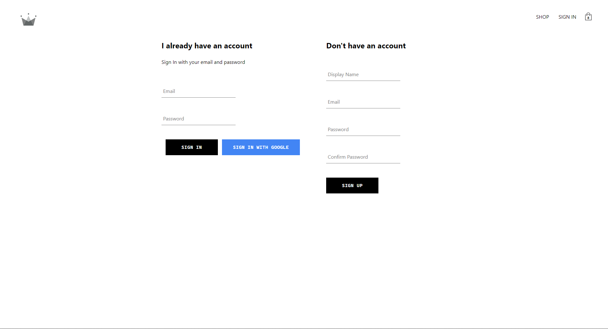
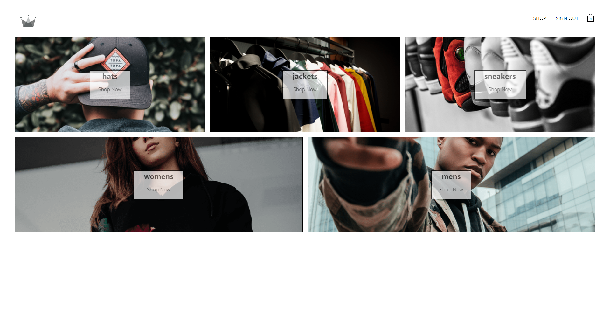
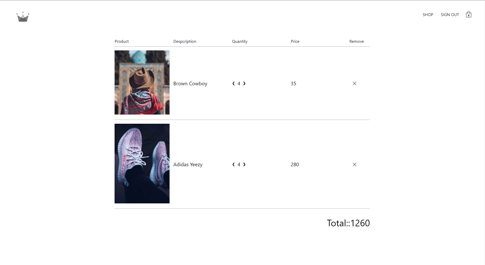

# E-Commerce Clothing Store (React)

## Description

This is a clothing store built with React, Redux, Redux Sagas, Firebase, and Stripe. It is a fully functional e-commerce store with user authentication, shopping cart, and payment processing.

## How to Run

1. Clone the repository
2. Run `npm install`
3. Run `npm start`
4. Open [http://localhost:3000](http://localhost:3000) to view it in the browser.

## Screenshots

